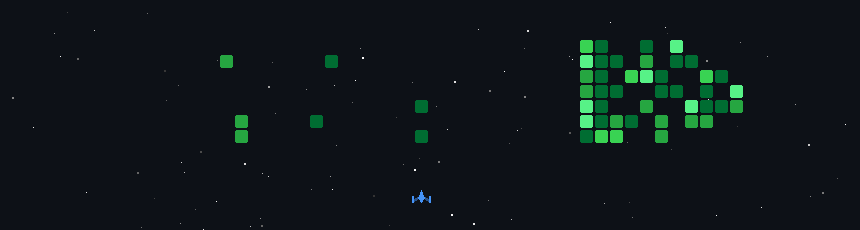

# 👋 Hi, I'm Yashvardhan Singh (Sapair-og)

I am a Computer Science student and researcher focused on **Materials Informatics**, **Deep Learning**, and **Systems Engineering**. I love coding, AI/ML, and building real-world applications to solve complex engineering and scientific problems.

---

## 🧪 Featured Project: Materials Informatics
### 🚀 [OptiFormulate / Building-Materials-Informatics](https://github.com/Sapair-og/Building-Materials-Informatics-)
*An end-to-end materials informatics workflow and active learning demo for optical nanocomposite formulations.*
- **Physics-Informed Data Generation:** Conversions of weight-to-volume fractions to apply Maxwell-Garnett Effective Medium Approximation (EMA) and Rayleigh-Gans light scattering models to generate physics-grounded noisy lab databases.
- **Predictive ML:** Built Gaussian Process Regression (GPR) and Random Forest models with 5-Fold Cross Validation.
- **Active Learning Recommender:** Integrated a Bayesian grid search using the Upper Confidence Bound (UCB) acquisition function to suggest next optimal experiments.
- **Production-Ready Deployment:** Exposes a high-performance **FastAPI REST API**, a **Streamlit Interactive UI**, and a **Dockerfile** for cloud hosting.

---

## 📁 Repository Directory

### 🧠 Deep Learning & Biomedical Computer Vision
- **[brain_tumor](https://github.com/Sapair-og/brain_tumor):** Deep learning architectures for brain tumor classification and segmentation.
- **[pneumonia_detection](https://github.com/Sapair-og/pneumonia_detection):** Convolutional Neural Network models to detect pneumonia from medical chest X-ray scans.
- **[redwine_classification](https://github.com/Sapair-og/redwine_classification):** Machine learning classification model evaluating red wine quality based on physicochemical properties.
- **[anime_recommedation](https://github.com/Sapair-og/anime_recommedation):** Recommendation engine matching user preferences with anime content.

### 🛠️ Software Engineering & Developer Tooling
- **[visual-canvas-builder](https://github.com/Sapair-og/visual-canvas-builder):** An interactive, drag-and-drop web canvas builder.
- **[code-debugger](https://github.com/Sapair-og/code-debugger):** Developer helper tools designed for automated error parsing and debugging.
- **[git-journey](https://github.com/Sapair-og/git-journey):** Interactive sandbox for mastering git version control.

### 🇯🇵 Spaced Repetition (SRS) Tools
- **[japanese_srs](https://github.com/Sapair-og/japanese_srs):** A web-based spaced repetition application designed to accelerate Japanese Kanji and vocabulary acquisition.

---

## 🛠️ Tech Stack & Skills
- **Languages:** Python, C++, JavaScript, HTML, CSS, SQL
- **ML & Data Science:** NumPy, Pandas, Scipy, Scikit-Learn, PyTorch, FastAPI, Streamlit, Matplotlib, Seaborn
- **DevOps & Tools:** Docker, Git & GitHub, Markdown, VS Code

---

## 📫 Let’s connect
- **GitHub:** You’re already here 😄
- *Open to collaborations, learning together, and materials informatics R&D opportunities!*

---

## 🎮 Contribution Space Shooter
My daily contribution grid transformed into a retro arcade space shooter battle! Commit blocks act as targets for the spaceship.

---

## 📊 GitHub Metrics

  
  

