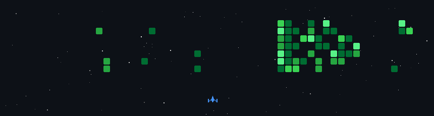

<p align="center">
  
</p>

<p align="center">
  <a href="https://github.com/Sapair-og">
    
  </a>
</p>

<p align="center">
  <a href="https://linkedin.com/in/yashvardhan-singh-sarangdevot"></a>
  <a href="mailto:singhyashvardhan341@gmail.com"></a>
  <a href="./Yashvardhan_Singh_Sarangdevot_Resume.pdf"></a>
  
</p>

<p align="center"></p>

## 👨‍💻 About Me

```python
class Yashvardhan:
    role      = "Python & GenAI Applications Developer"
    education = "B.Tech CSE @ VIT Bhopal (2023 – 2027) · CGPA 8.89/10"
    building  = "CogniCode — an agentic code-intelligence system"
    focus     = ["Agentic AI (LangGraph)", "RAG & Semantic Search",
                 "LLM Evaluation (LLM-as-a-Judge)", "Computer Vision"]
    fun_fact  = "Learning Japanese — so I built my own SRS app 🇯🇵"

    def say_hi(self):
        return "Open to internships & collaborations — let's build something!"
```

<p align="center"></p>

## 🛠️ Tech Stack

<p align="center">
  
</p>

<p align="center">
  
  
  
  
  
  
  
</p>

<p align="center"></p>

## 🌟 Main Projects

<table>
  <tr>
    <td colspan="2">
      <h3>🛡️ CogniCode — Agentic Code Intelligence System</h3>
      <p>A multi-agent system for debugging code and fixing vulnerabilities. It audits code with Python AST, recalls CWE/OWASP fix patterns from a FAISS episodic memory, runs specialised Security and Big-O profiling agents, generates patches with Pytest suites, and <b>self-heals in a sandbox loop</b> until the tests pass. It then opens a GitHub Pull Request automatically. Output quality is benchmarked with <b>LLM-as-a-Judge (JEV)</b>.</p>
      <p>
        <a href="https://github.com/Sapair-og/CogniCode"></a>
        
        
        
        
        
      </p>
    </td>
  </tr>
  <tr>
    <td width="50%" valign="top">
      <h3>🧠 Brain Tumor Detection</h3>
      <p>Classifies brain MRI scans into four classes: <b>glioma, meningioma, pituitary and no tumor</b>. It uses a ResNet50V2 model with transfer learning, augmentation and fine-tuning, reaching <b>95% validation accuracy</b>, and has an interactive Gradio app for predictions.</p>
      <p>
        <a href="https://github.com/Sapair-og/brain_tumor"></a>
        
        
        
      </p>
    </td>
    <td width="50%" valign="top">
      <h3>🩺 Pneumonia Detection</h3>
      <p>Detects pneumonia in chest X-rays using a DenseNet121 model trained with transfer learning. It includes training, evaluation and visualisation pipelines, plus a Gradio diagnostic app.</p>
      <p>
        <a href="https://github.com/Sapair-og/pneumonia_detection"></a>
        
        
        
      </p>
    </td>
  </tr>
  <tr>
    <td width="50%" valign="top">
      <h3>🇯🇵 Kyōto-Slate — Japanese SRS</h3>
      <p>A spaced-repetition app for Japanese vocabulary. It has a WaniKani-style dashboard, a JLPT N5/N4 Kanji Dojo with stroke-order tracing, typed answers with IME transliteration, audio pronunciation, and themed particle backgrounds.</p>
      <p>
        <a href="https://github.com/Sapair-og/japanese_srs"></a>
        <a href="https://japanese-srs-omega.vercel.app"></a>
        
      </p>
    </td>
    <td width="50%" valign="top">
      <h3>💬 Chat with PDF</h3>
      <p>A Streamlit RAG app for asking plain-English questions across several PDFs. It uses LangChain chunking, Hugging Face embeddings and FAISS vector search, and supports <b>OpenAI and Google Gemini</b> with conversational memory.</p>
      <p>
        <a href="https://github.com/Sapair-og/chat-with-pdf"></a>
        
        
        
      </p>
    </td>
  </tr>
</table>

<p align="center"></p>

## 🏆 Achievements & Certifications

| | |
| --- | --- |
| 🎓 | Selected for the **Amazon ML Summer School**, covering ML, deep learning and scalable AI workflows |
| ⚔️ | Solved **225+ algorithmic problems** on Codeforces and LeetCode |
| 👁️ | **Modern Computer Vision**: Deep Learning & OpenCV |
| 🐍 | **Python for Machine Learning & Data Science** |

<p align="center"></p>

## 📊 GitHub Analytics

<p align="center">
  
</p>

<p align="center">
  
</p>

<p align="center"></p>

## 🎮 Contribution Arcade

<p align="center">
  
</p>

<p align="center">
  <picture>
    <source media="(prefers-color-scheme: dark)" srcset="https://raw.githubusercontent.com/Sapair-og/Sapair-og/output/github-contribution-grid-snake-dark.svg" />
    
  </picture>
</p>

<p align="center">
  
</p>
